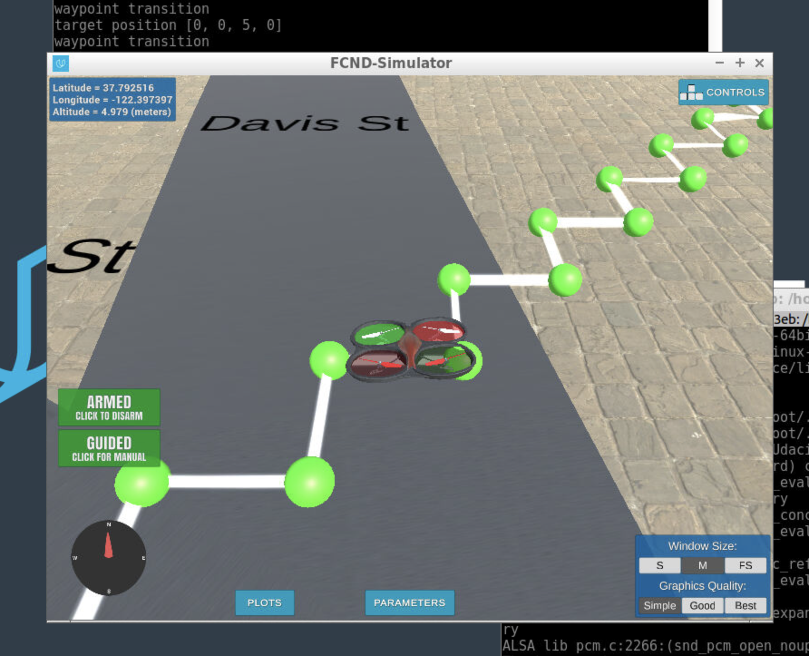

## Project: 3D Motion Planning

---

# Required Steps for a Passing Submission:
1. Load the 2.5D map in the colliders.csv file describing the environment.
2. Discretize the environment into a grid or graph representation.
3. Define the start and goal locations.
4. Perform a search using A* or other search algorithm.
5. Use a collinearity test or ray tracing method (like Bresenham) to remove unnecessary waypoints.
6. Return waypoints in local ECEF coordinates (format for `self.all_waypoints` is [N, E, altitude, heading], where the drone’s start location corresponds to [0, 0, 0, 0].
7. Write it up.
8. Congratulations!  Your Done!

## [Rubric](https://review.udacity.com/#!/rubrics/1534/view) Points
### Here I will consider the rubric points individually and describe how I addressed each point in my implementation.  

---
### Writeup / README

#### 1. Provide a Writeup / README that includes all the rubric points and how you addressed each one.  You can submit your writeup as markdown or pdf.  

You're reading it! Below I describe how I addressed each rubric point and where in my code each point is handled.

### Explain the Starter Code

#### 1. Explain the functionality of what's provided in `motion_planning.py` and `planning_utils.py`
The starter code provides a very simple flight path of travelling 10 meters north and east, without diagonal movement and any pruning of the waypoints.

The `motion_planning.py` defines the `MotionPlanning` `Drone` subclass. It also defintes the `States` enum. When the drone gets initialized, it sets initial values for its properties, most importantly it sets the `self.flight_state` to `MANUAL`. Additionally, the class subscribes to several callbacks for local position, local velocity and state changes. These callbacks are crucial for executing the flight plan.

As the state is changed to `MANUAL`, the `state_callback` calls the `arming_transition` function, which arms the drone and sets the state to `ARMING`. Again, the state change callback fires. This time the `plan_path` function is called.

The `plan_path` function is where the grid, heuristic, and a star generated for the flight plan. The state at this time is `PLANNING`. The first target position is set, which is the drone's `TARGET_ALTITUDE`. `create_grid`, `heuristic`, and `a_star` are helper functions from `planning_utils.py`. `create_grid` generates a 2D grid with the value `1` marking obstacles that are higher than the safety clearance required for the drone's altitude. The heuristic is euclidean. Then the `a_star` function generates a path from start to goal based on the grid and the heuristic. The goal for the starter code is simply 10 meters north and east from the start position. Finally, this path results in the waypoints that the drone will fly to.

The state change callback will transition the drone to `TAKEOFF` and raise it to it's target altitude. As the drone flies up, the `local_position_callback` is called. Once it is 95% at it's target position, which is the target altitude, the `waypoint_transition` function is called.

Now the drone is in the `WAYPOINT` state. The first waypoint in the list is accessed and also removed from the waypoint list. The waypoint is set as the target and the drone is commanded to fly there. The `local_position_callback` is called back as the drone moves, and when it is within 1 cubic meter of it's target waypoint, it executes the next waypoint if there is one. As the `waypoint_transition` pops through the waypoints and the drone travels to it's last waypoint, the drone will slow down. This drop in velocity triggers the `landing_transition` callback. 

The `landing_transition` commands the drone to land. As the drone lands, the `velocity_callback` is continuously called. When the difference between the altitudes of `global_position` and `global_home` are less than 0.1 meters, and the altitude of the `local_position` is less than 0.01 meters, the `disarming_transition` function is called. The drone is disarmed, released of control, state becomes `DISARMING`, and which in turn, the state callback will call the  `manual_transition` which terminates the mission.

These scripts contain a basic planning implementation that includes...

And here's a lovely image of my results (ok this image has nothing to do with it, but it's a nice example of how to include images in your writeup!)

Here's | A | Snappy | Table
--- | --- | --- | ---
1 | `highlight` | **bold** | 7.41
2 | a | b | c
3 | *italic* | text | 403
4 | 2 | 3 | abcd

### Implementing Your Path Planning Algorithm

#### 1. Set your global home position
Here students should read the first line of the csv file, extract lat0 and lon0 as floating point values and use the self.set_home_position() method to set global home. Explain briefly how you accomplished this in your code.

And here is a lovely picture of our downtown San Francisco environment from above!

#### 2. Set your current local position
Here as long as you successfully determine your local position relative to global home you'll be all set. Explain briefly how you accomplished this in your code.

Meanwhile, here's a picture of me flying through the trees!

#### 3. Set grid start position from local position
This is another step in adding flexibility to the start location. As long as it works you're good to go!

#### 4. Set grid goal position from geodetic coords
This step is to add flexibility to the desired goal location. Should be able to choose any (lat, lon) within the map and have it rendered to a goal location on the grid.

#### 5. Modify A* to include diagonal motion (or replace A* altogether)
Minimal requirement here is to modify the code in planning_utils() to update the A* implementation to include diagonal motions on the grid that have a cost of sqrt(2), but more creative solutions are welcome. Explain the code you used to accomplish this step.

#### 6. Cull waypoints 
For this step you can use a collinearity test or ray tracing method like Bresenham. The idea is simply to prune your path of unnecessary waypoints. Explain the code you used to accomplish this step.

### Execute the flight
#### 1. Does it work?
It works!

### Double check that you've met specifications for each of the [rubric](https://review.udacity.com/#!/rubrics/1534/view) points.
  
# Extra Challenges: Real World Planning

For an extra challenge, consider implementing some of the techniques described in the "Real World Planning" lesson. You could try implementing a vehicle model to take dynamic constraints into account, or implement a replanning method to invoke if you get off course or encounter unexpected obstacles.

